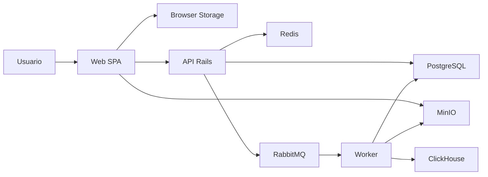

## Objetivo
Este guia consolida diretrizes de streamgate threat model para uso consistente no projeto.

## Estado atual
Conteudo alinhado ao estado atual de Back + Worker. Este threat model mantem o historico das ciclos de entrega anteriores como contexto, mas a leitura vigente passa a considerar auth real na API, upload assinado, worker RabbitMQ real, operacao segura mutavel, artefatos finais, notificacoes, dashboard expandida, realtime, exports, alert actions, conectores S3/HTTP e masking backend/frontend de payloads operacionais.

## Regras/Contratos
- As regras normativas deste tema estao descritas nas secoes tecnicas abaixo.
- Mudancas devem manter alinhamento com roadmap, ADRs e READMEs.

## Validacao/Evidencias
- Validar coerencia com README raiz, docs/README e roadmap da release atual.
- Registrar atualizacoes desta pagina no closeout do ciclo de entrega correspondente.

## Referencias
- [Roadmap mestre](C:/estudos/StreamGate/docs/planning/)
- [Governanca de documentacao](C:/estudos/StreamGate/docs/guides/operations/documentation-governance.md)

## Executive summary

O StreamGate ja possui um fluxo operacional real: `signed-url/public-link/connector -> storage -> upload/job -> RabbitMQ -> worker -> ClickHouse/realtime -> artefatos finais -> notificacoes -> command center/admin operations -> auditoria`. Os maiores riscos agora se concentram em proteger mutacoes operacionais sensiveis, exports, realtime events, conectores externos, signed download URLs curtas, replay aprovado de DLQ e payloads operacionais contra abuso, reuso indevido e vazamento.

## Operational safety security addendum

### Novas superficies materializadas

- API Rails com endpoints reais de `retry`, `resolve`, `dlq replay request/approve/execute`, `job artifacts`, `artifact download-url`, `notifications` e `notification-settings`.
- Worker Ruby gerando `processed_dataset`, `quality_report` e `audit_report`, registrando falhas nao bloqueantes de artefato e emitindo notificacoes operacionais.
- Frontend autenticado com inbox de notificacoes, painel admin-only de `Operacoes Seguras`, historico de artefatos e role gating para superficies sensiveis.
- Outbox interno para `email` e `webhook`, com deliveries persistidos, retry/backoff e payload sanitizado.
- Reports locais, E2E do caminho novo de notificacoes/operations e smoke ponta a ponta de operacao segura como evidencias operacionais.

### Controles confirmados

- `retry_job?`, `resolve_quarantine?`, `request_dlq_replay?`, `approve_dlq_replay?`, `execute_dlq_replay?`, `download_job_artifact?` e `manage_notification_settings?` formalizam RBAC por acao.
- `retry`, `resolve` e `webhook test` exigem `reason` e `Idempotency-Key`; replay da DLQ exige `request -> approve -> execute`, com bloqueio de self-approval.
- Eventos do worker continuam idempotentes por `event_id`; replay aprovado nao deve duplicar consumo nem artefatos ja consumidos.
- `audit_event.metadata`, payloads de notificacao/delivery e payloads de quarantine/DLQ passam por sanitizacao antes de exposicao ou envio.
- Download de artefato usa signed URL curta com `expires_at`; a API audita a geracao do link antes da entrega.
- `Notification`, `NotificationSetting`, `WebhookDelivery` e `OperationalActionIdempotencyKey` persistem trilha operacional, canais e reuso seguro de resposta.
- `scripts/smokes/run-smokes` cobre artifacts list/download-url, notificacoes, deliveries persistidos, retry/resolve/replay e audit trail coerente com o fluxo operacao segura.

### Riscos residuais aceitos para operacao segura

- Autenticacao/autorizacao entre servicos internos ainda depende da rede local/Compose; assinatura forte de eventos e webhook receiver real ficam para evolucao posterior.
- Replay prevention e suficiente para o corte atual por `event_id` + aprovacao humana + idempotencia, mas ainda nao ha janela temporal assinada nem nonce externo entre servicos.
- Deliveries `email/webhook` sao persistidos e auditados, mas ainda dependem de politicas futuras de rate limiting externo, allowlist de destino e observabilidade remota.
- `public_link` foi materializado como primeiro corte de `external_link`; na command center operacional, `s3` e `http_url` ganham corte API+worker com perfis admin-only e lease interno; `oauth_delegated` e `google_drive` seguem discovery-only.

## Command center security addendum

- Dashboard expandida usa ClickHouse-first com fallback Postgres honesto, source health, exports mascarados e alert review/dismiss persistentes.
- Realtime usa ticket curto assinado, escopo por usuario/organizacao/role e polling fallback em `realtime_events` duravel.
- Conectores S3/HTTP usam Active Record Encryption, resposta publica mascarada, `X-Worker-Token` no lease interno e nenhum segredo em evento/log/resposta publica.
- HTTP connector aplica bloqueio de localhost/private/link-local/metadata host, validacao de redirect e resolucao DNS antes de baixar.
- Worker aceita NDJSON, ZIP seguro, XLSX e Parquet quando runtime nativo estiver disponivel, com limite 10 GB, cleanup best-effort e ClickHouse sem payload bruto.

## Workspace operational security addendum

- A API aceita apenas `http`/`https`, sem userinfo e sem portas nao padrao.
- O worker valida DNS antes de cada `HEAD`/`GET`, segue no maximo tres redirects e bloqueia localhost, ranges privados, link-local e metadata hosts.
- URLs expostas por API e auditoria usam `url_masked` e `url_hash`; query string, fragmento e credenciais nao aparecem em recursos HTTP.
- Downloads remotos sao gravados por stream em `Tempfile`, com limite configuravel alinhado a 10 GB e SHA-256 calculado durante a copia.
- Falhas tecnicas viram `operational_warnings` com retencao padrao de 30 dias, sem impedir acesso aos artefatos ja disponiveis.
- Dashboard e warehouse distinguem `live`, `derived`, `empty` e `degraded` para evitar dados cenograficos.
- ClickHouse recebe apenas metadados analiticos de jobs/registros e HMAC-SHA256 de registros; payload bruto nao e replicado no OLAP. O TTL padrao e 30 dias e falha de carga gera warning tecnico nao bloqueante.
## Scope and assumptions

### In-scope paths

- `apps/web`
- `apps/api`
- `apps/worker`
- `packages/contracts`
- `compose.yaml`
- `.env.example`
- `docs/product/vision.md`
- `docs/guides/*.md`

### Out-of-scope items

- vendor directories e dependencias geradas
- infraestrutura de producao ainda nao materializada
- cluster Kubernetes e deploy real, ainda nao implementados
- dados reais de cliente, nao presentes no repositorio

### Assumptions

- o estado atual do repositorio representa um baseline de desenvolvimento local, nao um ambiente de producao
- a aplicacao ainda nao esta exposta publicamente como producao
- o dashboard autenticado usa sessao/token emitido pela API no ambiente local; politicas de cookie/CSRF/TLS ainda dependem do desenho de deploy
- os servicos do `compose.yaml` podem ficar acessiveis apenas em ambiente local controlado
- multi-tenant, segredos de producao e dados sensiveis reais ainda nao fazem parte da stack materializada

### Open questions that would materially change the risk ranking

- algum ambiente de preview ou demo hoje reaproveita o auth mock do frontend?
- algum time pretende expor o `compose.yaml` atual fora de maquina local ou rede de desenvolvimento controlada?
- a v1 vai tratar dados regulados ou sensiveis alem de metadados operacionais?

## System model

### Primary components

- `web`: SPA React/Vite com landing, auth mock, route guard e dashboard shell
- `api`: Rails API-only com health check, OpenAPI base e configuracao para PostgreSQL/Redis
- `worker`: app Ruby separado com runtime real de fila RabbitMQ para `upload.received.v1`
- `postgres`: estado operacional
- `redis`: cache/estado volatil de suporte
- `rabbitmq`: broker planejado para eventos de ingestao e processamento
- `minio`: object storage para arquivos brutos
- `clickhouse`: leitura analitica planejada
- `contracts`: schemas e exemplos HTTP/eventos usados para rastreabilidade e sincronizacao com OpenAPI

Evidence anchors principais:

- [compose.yaml](C:/estudos/StreamGate/compose.yaml)
- [vision.md](C:/estudos/StreamGate/docs/product/vision.md)
- [architecture.md](C:/estudos/StreamGate/docs/guides/platform/architecture.md)
- [backend-foundations.md](C:/estudos/StreamGate/docs/guides/backend/backend-foundations.md)

### Data flows and trust boundaries

- Internet -> Web SPA
  Dados: navegacao, credenciais mock de login, interacoes de dashboard. Canal: HTTP browser para app estatico/dev server. Garantias atuais: nenhuma autenticacao real; `ProtectedRoute` apenas verifica sessao local.
- Browser storage -> Web SPA
  Dados: sessao e perfil mockados. Canal: `localStorage` e `sessionStorage`. Garantias atuais: nenhuma integridade forte; dados sao controlaveis pelo usuario do browser.
- Web SPA -> API
  Dados: auth, upload/jobs e leituras operacionais. Canal: HTTP. Garantias atuais: bearer token emitido pela API, OpenAPI sincronizado, erros padronizados e role gating para audit/DLQ.
- API -> PostgreSQL / Redis
  Dados: estado operacional e suporte. Canal: conexoes internas de servico. Garantias atuais: credenciais via env e rede Docker local.
- API -> RabbitMQ
  Dados: eventos planejados de upload/job. Canal: AMQP futuro. Garantias atuais: fronteira apenas desenhada, ainda sem contrato executavel.
- Web SPA -> MinIO
  Dados: upload direto planejado via URL assinada. Canal: HTTP/S3 API futura. Garantias atuais: bucket privado no compose, mas fluxo assinado ainda nao existe.
- Worker -> MinIO / RabbitMQ / PostgreSQL / ClickHouse
  Dados: arquivos, eventos, estados operacionais e carga analitica. Canal: dependencias internas planejadas. Garantias atuais: runtime ainda nao materializado.

#### Diagram

## Assets and security objectives

| Asset | Why it matters | Security objective (C/I/A) |
| --- | --- | --- |
| Sessao e perfil do usuario | definem acesso ao workspace e experiencia autenticada | I, C |
| Credenciais e envs locais | controlam banco, broker, storage e analytics | C, I |
| Bucket bruto de upload | pode concentrar arquivos grandes e dados sensiveis | C, I, A |
| Eventos de upload/job | controlam inicio, progresso e conclusao do pipeline | I, A |
| Estado operacional em PostgreSQL | suporta auditoria, quarentena e status de jobs | C, I, A |
| Dados analiticos em ClickHouse | podem expor agregados ou volumes relevantes do negocio | C, I |
| Logs e trilha de auditoria | base para investigacao e resposta a incidente | I, A |
| OpenAPI e contratos | definem o que consumidores vao confiar como interface | I |

## Attacker model

### Capabilities

- usuario remoto capaz de manipular browser storage, rotas e payloads do frontend
- operador ou desenvolvedor que, por erro, reaproveite defaults locais em ambiente compartilhado
- atacante com acesso de rede a um ambiente mal exposto contendo portas administrativas do compose
- futuro consumidor ou produtor de eventos que tente enviar payloads fora do contrato se broker e worker nascerem sem protecao suficiente

### Non-capabilities

- nao assumimos acesso direto do atacante ao host local do desenvolvedor sem outra falha previa
- nao assumimos multi-tenancy produtivo ou dados regulados ja em producao
- nao assumimos `google_drive` nem `oauth_delegated` funcionais
- nao assumimos que operadores tenham acesso a configuracao, segredo ou teste de conectores S3/HTTP

## Entry points and attack surfaces

| Surface | How reached | Trust boundary | Notes | Evidence |
| --- | --- | --- | --- | --- |
| Auth mock do frontend | paginas `/login`, `/register`, `/reset-password`, `ProtectedRoute` | browser -> SPA e browser storage -> SPA | controle de acesso atual e apenas de UX | `apps/web/src/App.tsx`, `apps/web/src/lib/auth.ts` |
| Browser storage | `localStorage` e `sessionStorage` | usuario/browser -> SPA | sessao e perfil podem ser manipulados pelo proprio usuario | `apps/web/src/lib/auth.ts` |
| Health e docs da API | `GET /up` e `/api-docs` | cliente -> API | superficie HTTP real mais visivel no estado atual | `apps/api/config/routes.rb`, `apps/api/openapi/v1/openapi.yaml` |
| Portas do compose | Postgres, Redis, RabbitMQ, MinIO, ClickHouse, API, Web | host -> containers | exposicao local e ampla na baseline de dev | `compose.yaml` |
| Console do MinIO | porta administrativa 9001 | host -> MinIO console | risco sobe se credenciais simples vazarem para ambiente compartilhado | `compose.yaml`, `.env.example` |
| RabbitMQ management | porta 15672 | host -> broker | ainda sem uso de negocio, mas ja e superficie administrativa | `compose.yaml`, `.env.example` |
| Upload direto e link publico | dashboard, upload center e API | browser/API -> storage externo ou bruto | fluxo funcional com allowlist, masking e confirmacao | `apps/api/app/services/uploads`, `apps/worker/lib/worker/processing` |
| Pipeline de eventos | API -> broker -> worker | servicos internos | eventos reais exigem contrato, idempotencia e DLQ | `docs/guides/platform/architecture.md`, `packages/contracts/README.md` |
| Realtime dashboard | API -> Action Cable/polling -> browser | API -> browser autenticado | tickets curtos e eventos duraveis sanitizados | `apps/api/app/channels`, `apps/api/app/models/realtime_event.rb` |
| Dashboard exports e alert actions | browser -> API -> Postgres/audit | usuario autenticado -> operacao sensivel | exige RBAC, idempotencia, masking e auditoria | `apps/api/app/controllers/api/v1/dashboard_exports_controller.rb`, `apps/api/app/controllers/api/v1/alerts_controller.rb` |
| Conectores S3/HTTP | admin API -> worker -> rede externa/storage | API/worker -> sistemas externos | secrets criptografados, lease interno, anti-SSRF e masking | `apps/api/app/models/connector_profile.rb`, `apps/worker/lib/worker/runtime/connector_fetcher.rb` |

## Top abuse paths

1. O atacante manipula `localStorage` ou `sessionStorage`, forja uma sessao valida no browser e acessa o dashboard mock como se estivesse autenticado.
2. Um ambiente compartilhado sobe com credenciais simples copiadas de `.env.example`, expondo MinIO ou RabbitMQ management para acesso indevido.
3. O fluxo de upload ou conector aceita arquivo fora do contrato, permitindo abuso de storage, processamento excessivo ou falha operacional.
4. A API ou o worker passam a aceitar eventos sem contrato forte, possibilitando criacao falsa de jobs, replay indevido ou estados inconsistentes.
5. Segredos reais entram por engano em `.env`, docs ou screenshots, e acabam vazando via Git, PR ou logs.
6. O dashboard mistura leitura operacional e analitica sem authz clara, expondo mais dado do que o perfil do usuario deveria ver.
7. Um perfil HTTP e criado com URL interna, redirect malicioso ou DNS rebind para acessar metadata service, localhost ou rede privada.
8. Exports, realtime events ou warnings carregam URL, header, bucket/object key ou credencial nao mascarada.

## Threat model table

| Threat ID | Threat source | Prerequisites | Threat action | Impact | Impacted assets | Existing controls (evidence) | Gaps | Recommended mitigations | Detection ideas | Likelihood | Impact severity | Priority |
| --- | --- | --- | --- | --- | --- | --- | --- | --- | --- | --- | --- | --- |
| TM-001 | usuario remoto no browser | acesso ao frontend e capacidade de editar storage local | manipula sessao/token local ou tenta reutilizar token expirado | acesso indevido ao workspace se a API aceitar sessao invalida ou se o frontend mascarar falha de auth | sessao, perfil, dashboard | API valida bearer token e retorna `401/403`; frontend reage a auth failure; evidencias em `apps/api/app/controllers/application_controller.rb`, `apps/web/src/lib/api-client.ts` e `apps/web/src/features/auth/protected-route.tsx` | hardening produtivo de cookies/CSRF/TLS ainda depende do desenho de deploy | manter token local apenas no contexto atual; revisar politica de sessao antes de preview/producao; cobrir regressao de auth em CI | testes de auth flow, logs de `request_id`, falhas `session_expired` e revisao de rotas protegidas | medium | high | high |
| TM-002 | operador ou atacante com acesso de rede ao host exposto | ambiente compartilhado usando defaults locais ou portas abertas | acessa MinIO, RabbitMQ ou banco com credenciais fracas de baseline | takeover operacional, leitura/escrita indevida e indisponibilidade | segredos, storage, broker, banco | docs dizem que `.env` real nao sobe para Git; MinIO raw inicia privado; evidencias em `.env.example`, `compose.yaml` e `docs/guides/platform/setup.md` | credenciais de exemplo sao simples e portas administrativas estao publicadas no host local | proibir promocao de `.env.example`; usar segredos unicos por ambiente; reduzir portas expostas fora de dev; revisar perfis antes de preview/producao | alertar quando compose compartilhar management ports; revisar envs e portas no PR | medium | high | high |
| TM-003 | usuario de upload ou atacante explorando entrada de arquivo | signed URL e registro de upload disponiveis | envia arquivo fora do contrato, volumetria abusiva ou conteudo inesperado | abuso de armazenamento, custo, falha operacional e pipeline contaminado | bucket bruto, worker, disponibilidade | tipos permitidos, TTL, storage_key controlado, confirmacao pos-upload, checksum/idempotencia e smoke assinado existem | politica de malware scanning, quotas por organizacao e conectores externos ainda nao existem | manter allowlist de content type/tamanho, evoluir quotas/scanning antes de dados reais sensiveis e revisar conectores separadamente | metricas por bucket, alertas de volume, logs por `upload_id`, falhas de validacao | medium | high | high |
| TM-004 | produtor/consumidor interno mal configurado ou comprometido | broker ativo e acesso interno ao exchange | publica ou consome evento invalido, replayado ou forjado | estados falsos de job, processamento indevido ou duplicacao | eventos, jobs, auditoria, disponibilidade | evento `upload.received.v1`, idempotencia por `event_id`, validacao de campos obrigatorios, retry limitado e DLQ existem | assinatura/autenticacao forte entre servicos e janela temporal anti-replay ainda nao existem | evoluir schema validation executavel, assinatura de evento e alertas de rejeicao/DLQ antes de novos produtores | logs estruturados por `event_id`, `trace_id`, `job_id`; metricas de retry/DLQ | medium | high | high |
| TM-005 | erro operacional interno ou vazamento em PR/log | uso de segredos reais no repo, docs ou exemplos | expoe credenciais em Git, screenshots, logs ou fixtures | comprometimento de servicos e perda de confianca operacional | segredos, banco, storage, broker | Rails filtra parametros sensiveis em logs; docs avisam para nao subir `.env`; evidencias em `apps/api/config/initializers/filter_parameter_logging.rb` e `.env.example` | ainda nao existe politica formal de segredos antes deste ciclo de entrega | adotar politica minima de segredos, revisar arquivos sensiveis em PR e usar scanners de dependencia/config proporcionais | checklist de PR, busca por padroes sensiveis, revisao de docs e envs | medium | medium | medium |
| TM-006 | consumidor autenticado com permissao mal definida | dashboard, analytics, quarantine, audit e DLQ reais | acessa mais dado operacional ou analitico do que deveria | exposicao de informacao e quebra de segregacao funcional | dashboards, analytics, auditoria, quarantine, DLQ | audit/DLQ admin-only; analytics/quarantine escopados por organizacao; frontend oculta Auditoria para operador; serializers sanitizam payloads | classificacao de dados do dominio ainda precisa aprofundar dado real de cliente | manter testes de autorizacao por role, revisar novos campos antes de expor e classificar payloads de conectores externos | auditoria de consultas, logs por usuario, testes de autorizacao | medium | high | high |
| TM-007 | admin mal-intencionado ou atacante com acesso admin | perfil HTTP/S3 configuravel e worker com saida de rede | cria URL interna, redirect malicioso, DNS rebind ou S3 object key sensivel | SSRF, exfiltracao interna, abuso de storage ou custo | worker, rede interna, storage, segredos de conector | HTTP bloqueia localhost/private/link-local/metadata host, valida redirects, resolve DNS e mascara URL/header; S3 nao retorna bucket/key/secret publicamente | listas de allow/deny de egress ainda dependem do ambiente de deploy | adicionar egress policy em infra, registrar host/hash sem segredo e manter testes de SSRF/DNS rebind | warnings de conector, auditoria por profile/ingestion, metricas de falha por host hash | medium | high | high |
| TM-008 | usuario autenticado ou integracao com acesso a dashboard | exports, realtime events e alert actions | forca export/evento contendo payload sensivel ou repete mutacao sem idempotencia | vazamento operacional, trilha de auditoria ambigua ou estado inconsistente | dashboard exports, realtime events, warnings, audit | exports mascaram linhas, realtime payload passa por sanitizer, alert review/dismiss exige RBAC e `Idempotency-Key` | classificacao fina por campo ainda evolui conforme dados reais | manter allowlist/denylist de campos, testes de masking e revisao de novos payloads antes de expor | auditoria de export/action, amostragem de payload sanitizado, contract tests | medium | high | high |
| TM-009 | produtor interno ou arquivo externo malicioso | parser aceita NDJSON/XLSX/Parquet/ZIP | envia arquivo gigante, zip bomb, zip slip ou formato ambiguo | indisponibilidade do worker, erros nao seguros ou payload bruto no warehouse | worker, tempfiles, ClickHouse, storage | limite 10 GB, ZIP com exatamente um arquivo suportado, cleanup best-effort, warehouse sem payload bruto e erros seguros | malware scanning e quotas por org ainda nao estao materializados | evoluir quotas/scanning, acompanhar tempo/memoria por parser e manter corpus de casos hostis | metricas de parser, warnings tecnicos, falhas por content type | medium | high | high |

## Criticality calibration

Para este repositorio, a calibracao deve considerar o estado atual de fundacao e o fato de muitas superficies ainda serem planejadas.

- `critical`: auth bypass em ambiente real, exfiltracao de segredos reais, takeover de storage/broker/banco em ambiente compartilhado, ou upload sem controle levando a comprometimento operacional severo.
- `high`: defaults locais promovidos para preview/producao, eventos forjados no pipeline, upload/conector sem contrato/limites, dashboard real expondo dado entre perfis.
- `medium`: vazamento de exemplos sensiveis, falhas de logging/auditoria, separacao insuficiente entre visao operacional e analitica ainda sem dado sensivel real.
- `low`: inconsistencias de documentacao, superficies desenhadas mas ainda nao executaveis, ou gaps que dependem de multiplas precondicoes nao presentes hoje.

Exemplos para este repo:

- `critical`: usar auth mock com dados reais; expor MinIO/RabbitMQ com credenciais reais fracas em ambiente compartilhado.
- `high`: abrir upload/conector sem validacao de tamanho/tipo/checksum, aceitar eventos sem contrato versionado ou permitir SSRF em HTTP connector.
- `medium`: exemplos de env com valores sensiveis indevidos em docs; logs sem `trace_id` em fluxos internos.
- `low`: texto de roadmap sem refletir um scanner futuro ainda nao automatizado.

## Focus paths for security review

| Path | Why it matters | Related Threat IDs |
| --- | --- | --- |
| `apps/web/src/lib/auth.ts` | concentra o auth mock e o uso de storage no browser | TM-001 |
| `apps/web/src/features/auth/protected-route.tsx` | representa o gate visual do workspace autenticado | TM-001 |
| `apps/api/config/routes.rb` | define a superficie HTTP atual e futura expansao de endpoints | TM-003, TM-006 |
| `apps/api/openapi/v1/openapi.yaml` | vai materializar o contrato publico confiado por clientes | TM-003, TM-006 |
| `apps/api/app/controllers/api/v1/connectors` | concentra a superficie admin-only de perfis, testes e ingestions de conectores | TM-007, TM-008 |
| `apps/api/app/services/operational/payload_masker.rb` | mascara payloads antes de exports, realtime e respostas publicas | TM-006, TM-008 |
| `apps/worker/lib/worker/runtime/connector_fetcher.rb` | aplica anti-SSRF, redirect checks e masking para HTTP/S3 | TM-007 |
| `apps/worker/lib/worker/processing/csv_zip_parser.rb` | aplica limites e regras de parsing para CSV/JSON/NDJSON/ZIP/XLSX/Parquet | TM-003, TM-009 |
| `apps/api/config/initializers/filter_parameter_logging.rb` | mostra o baseline atual de protecao contra vazamento em logs | TM-005 |
| `compose.yaml` | concentra exposicao de portas, servicos administrativos e envs de infra | TM-002, TM-004 |
| `.env.example` | explicita defaults de desenvolvimento que nao podem ser promovidos | TM-002, TM-005 |
| `packages/contracts/README.md` | ancora a futura integridade do pipeline de eventos | TM-004 |
| `docs/product/vision.md` | descreve o upload direto, eventos e leitura analitica que definem o risco futuro | TM-003, TM-006 |
| `docs/guides/backend/backend-foundations.md` | fixa rastreabilidade e responsabilidades da API/worker | TM-004, TM-005 |

## Quality check

- entry points descobertos foram cobertos: frontend auth mock, browser storage, API health/docs, compose ports, upload, realtime, exports, conectores e broker
- cada trust boundary principal apareceu nas ameacas: browser, API, storage, broker, analytics, worker, rede externa e segredos operacionais
- runtime foi separado de tooling/dev: risco de compose local foi tratado como baseline operacional, nao como producao
- este documento foi fechado com suposicoes explicitas porque o contexto de exposicao e deploy real ainda nao foi validado pelo time
- conclusoes condicionais foram marcadas especialmente nas trilhas de conectores, egress de rede, malware scanning e classificacao fina de dados reais
