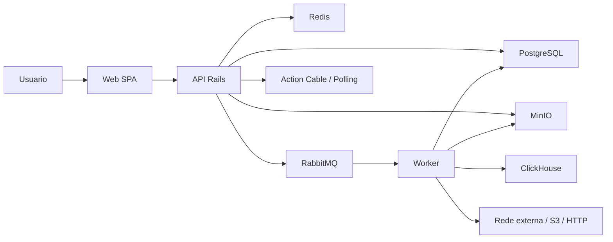

# StreamGate Threat Model

Este threat model cobre o estado operacional atual do StreamGate: auth real, upload assinado, public link, conectores S3/HTTP, worker RabbitMQ, ClickHouse, realtime dashboard, exports, alert actions, artefatos, notificacoes, safe operations e auditoria.

## Validacao E Evidencias

- Validar coerencia com README raiz, API docs, contracts, workspace map e roadmap da release atual.
- Atualizar este documento quando novas superficies de auth, upload, conector, worker, artifact, realtime, export, audit ou deploy forem abertas.

## Escopo

Inclui:

- SPA React autenticada;
- API Rails no namespace `/api/v1`;
- PostgreSQL, Redis, MinIO, RabbitMQ e ClickHouse;
- worker Ruby;
- OpenAPI e `packages/contracts`;
- smokes, reports e CI local/remoto;
- conectores S3/HTTP e public link.

Fora do escopo atual:

- cluster produtivo;
- dados reais de cliente versionados no repo;
- Google Drive e OAuth delegado como fluxos funcionais;
- observabilidade distribuida completa.

## Assumptions

- O ambiente local/Compose nao e producao.
- Tokens e segredos produtivos nao devem ser reaproveitados em desenvolvimento.
- Admins podem configurar conectores; operadores nao veem segredos nem controles sensiveis.
- ClickHouse nao recebe payload bruto de registros, apenas metadados, agregados e fingerprints.
- GitHub Actions e o CI remoto oficial; CircleCI e externo se aparecer como check.

## System Model

| Componente | Papel |
| --- | --- |
| Web SPA | auth, workspace, command center, upload, connectors UI e operacao |
| API Rails | auth, RBAC, contratos HTTP, auditoria, dashboards, actions e leases |
| Worker Ruby | ETL, parsing, artifacts, ClickHouse, realtime best-effort e connectors fetch |
| PostgreSQL | estado operacional, auditoria, warnings, jobs e configuracoes |
| RabbitMQ | eventos duraveis e DLQ |
| MinIO | bruto e artefatos |
| ClickHouse | agregados analiticos sem payload bruto |
| Redis | suporte/cache/estado volatil |
| Contracts | schemas e exemplos versionados |

## Trust Boundaries

| Fronteira | Dados | Controle atual |
| --- | --- | --- |
| Browser -> Web | token, role, filtros, inputs | route guard, API auth failure handling, masking visual |
| Web -> API | auth, uploads, actions, filters | bearer token, RBAC, envelopes, idempotency, validation |
| API -> Storage/Broker/DB | jobs, events, artifacts | envs, service network local, audit, retries |
| API -> Browser realtime | events, alerts, source health | ticket curto, org/role scope, sanitizer, polling fallback |
| Worker -> External | public link, S3, HTTP | anti-SSRF, redirect checks, secrets encryption, leases |
| Worker -> ClickHouse | analytics rows | no raw payload, HMAC/fingerprints, warnings on failure |

## Assets

- sessoes e perfis de usuario;
- segredos de ambiente e connector profiles;
- arquivos brutos e artefatos finais;
- eventos RabbitMQ e realtime events;
- estado operacional em PostgreSQL;
- agregados ClickHouse;
- audit trail e warnings;
- contratos OpenAPI/JSON Schema;
- docs e reports de release.

## Entry Points

| Surface | Risco principal | Evidencia |
| --- | --- | --- |
| Auth API e SPA | token reutilizado, sessao expirada ou role gating quebrado | `apps/api/app/controllers/api/v1/auth`, `apps/web/src/features/auth` |
| Upload local/public link | abuso de storage, SSRF, formato hostil | `apps/api/app/services/uploads`, `apps/worker/lib/worker/processing` |
| Connectors S3/HTTP | credencial exposta, SSRF, redirect malicioso | `apps/api/app/controllers/api/v1/connectors`, `apps/worker/lib/worker/runtime/connector_fetcher.rb` |
| Dashboard exports/actions | vazamento em CSV/JSON, replay de mutacao | `dashboard_exports_controller`, `alerts_controller` |
| Realtime | evento forjado ou payload sensivel | `app/channels`, `RealtimeEvent`, payload sanitizer |
| Safe operations | retry/replay indevido | operations controllers/services |
| DLQ/quarantine/audit | exposicao entre roles/orgs | policies, serializers e frontend route gating |
| Compose ports | admin consoles locais expostos | `compose.yaml`, `.env.example` |

## Top Abuse Paths

1. Reutilizar defaults locais ou segredos de exemplo fora de dev.
2. Expor MinIO/RabbitMQ/Postgres/ClickHouse em rede compartilhada.
3. Criar connector HTTP apontando para localhost, metadata service ou rede privada.
4. Exportar payload, header, object key, URL ou credencial sem masking.
5. Repetir alert action, export ou safe operation sem idempotencia.
6. Enviar ZIP, XLSX, Parquet ou NDJSON hostil para exaurir worker.
7. Quebrar role/org scope em dashboard, audit, DLQ ou connectors.
8. Publicar evento interno fora de contrato e corromper estado de job.

## Threat Table

| ID | Fonte | Acao | Impacto | Controles | Gaps |
| --- | --- | --- | --- | --- | --- |
| TM-001 | usuario remoto | tenta usar token expirado ou manipular role local | acesso indevido ao workspace | API valida token, frontend trata 401/403, rotas admin-only | hardening final de cookie/CSRF/TLS depende do deploy |
| TM-002 | operador/ambiente | promove `.env.example` ou portas locais | takeover de storage/broker/banco | docs, `.gitignore`, envs separados | policy de secret manager produtivo ainda futura |
| TM-003 | usuario de upload | envia arquivo fora do contrato ou volumetria abusiva | custo, indisponibilidade, falha de parsing | allowlist, checksum, idempotencia, limites, ZIP seguro | malware scanning e quotas por org ainda futuras |
| TM-004 | produtor interno | publica evento invalido/replayado | job falso, duplicado ou inconsistente | contracts, idempotencia por event/job, DLQ | assinatura de evento ainda futura |
| TM-005 | erro interno | vaza segredo em docs, PR ou log | comprometimento operacional | Rails filtering, masking, docs de segredo | secret scanning remoto deve ser revisado na release |
| TM-006 | usuario autenticado | acessa dados fora do papel/org | vazamento operacional | policies, serializers, route gating, tests | classificacao fina por campo evolui com dados reais |
| TM-007 | admin/conector | usa HTTP connector para SSRF | acesso a rede interna | bloqueio private/link-local/metadata, redirect checks | egress policy de infra futura |
| TM-008 | dashboard user | exporta evento/payload sensivel | vazamento via CSV/JSON/realtime | operational masker, idempotency, audit | revisao continua de novos campos |
| TM-009 | arquivo hostil | zip bomb, zip slip, parser abuse | indisponibilidade worker | limites, tempfiles, cleanup, safe errors | corpus amplo de fuzz/malware futuro |

## Review Focus

- `apps/api/openapi/v1/openapi.yaml`
- `packages/contracts`
- `apps/api/app/policies`
- `apps/api/app/services/operational/payload_masker.rb`
- `apps/api/app/controllers/api/v1/connectors`
- `apps/worker/lib/worker/runtime/connector_fetcher.rb`
- `apps/worker/lib/worker/processing`
- `apps/web/src/lib/streamgate-api.ts`
- `apps/web/src/lib/dashboard-realtime.ts`
- `apps/web/src/pages/SettingsPage.tsx`
- `.env.example`
- `compose.yaml`

## Release Security Checklist

- Verificar ausencia de segredos reais em docs, examples, fixtures e reports versionados.
- Confirmar que operadores nao veem conectores, audit, DLQ ou actions admin-only.
- Confirmar que exports e realtime payloads sao mascarados.
- Confirmar que connector HTTP bloqueia localhost/private/link-local/metadata e redirects inseguros.
- Confirmar que S3 nao expõe bucket/key/secret em UI, API, eventos ou logs.
- Confirmar que OpenAPI/contracts nao documentam campos sensiveis como resposta publica.
- Confirmar que full-closeout, smokes e GitHub Actions estao verdes antes de merge.
