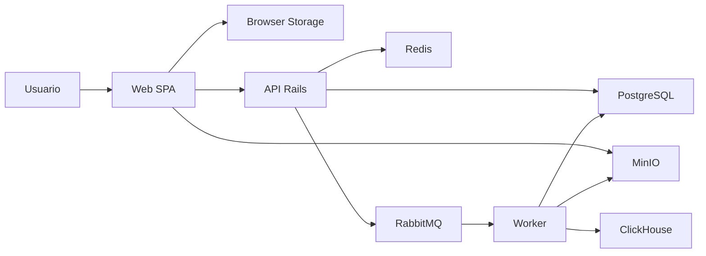

## Executive summary

O StreamGate ainda esta em fase de fundacao, entao o risco mais importante da Sprint 0 nao e uma vulnerabilidade de negocio ja exploravel, e sim a chance de as proximas sprints herdarem defaults inseguros nas fronteiras que ja estao desenhadas no repo: auth, upload, storage, broker e dashboards. Os maiores riscos atuais sao promover o auth mock do frontend para um contexto indevido, reutilizar credenciais simples do ambiente local em ambientes compartilhados e abrir as superficies futuras de upload e mensageria sem contrato, validacao e revisao de seguranca proporcionais.

## Scope and assumptions

### In-scope paths

- `apps/web`
- `apps/api`
- `apps/worker`
- `packages/contracts`
- `compose.yaml`
- `.env.example`
- `docs/product/vision.md`
- `docs/guides/*.md`

### Out-of-scope items

- vendor directories e dependencias geradas
- infraestrutura de producao ainda nao materializada
- cluster Kubernetes e deploy real, ainda nao implementados
- dados reais de cliente, nao presentes no repositorio

### Assumptions

- o estado atual do repositorio representa um baseline de desenvolvimento local, nao um ambiente de producao
- a aplicacao ainda nao esta exposta publicamente com auth real ou upload real
- o dashboard autenticado atual usa sessao simulada apenas para UX e nao deve ser tratado como controle real de acesso
- os servicos do `compose.yaml` podem ficar acessiveis apenas em ambiente local controlado
- multi-tenant, segredos de producao e dados sensiveis reais ainda nao fazem parte da stack materializada

### Open questions that would materially change the risk ranking

- algum ambiente de preview ou demo hoje reaproveita o auth mock do frontend?
- algum time pretende expor o `compose.yaml` atual fora de maquina local ou rede de desenvolvimento controlada?
- a v1 vai tratar dados regulados ou sensiveis alem de metadados operacionais?

## System model

### Primary components

- `web`: SPA React/Vite com landing, auth mock, route guard e dashboard shell
- `api`: Rails API-only com health check, OpenAPI base e configuracao para PostgreSQL/Redis
- `worker`: app Ruby separado, ainda sem runtime real de fila
- `postgres`: estado operacional
- `redis`: cache/estado volatil de suporte
- `rabbitmq`: broker planejado para eventos de ingestao e processamento
- `minio`: object storage para arquivos brutos
- `clickhouse`: leitura analitica planejada
- `contracts`: placeholder documental para eventos e rastreabilidade

Evidence anchors principais:

- [compose.yaml](C:/estudos/StreamGate/compose.yaml)
- [vision.md](C:/estudos/StreamGate/docs/product/vision.md)
- [architecture.md](C:/estudos/StreamGate/docs/guides/architecture.md)
- [backend-foundations.md](C:/estudos/StreamGate/docs/guides/backend-foundations.md)

### Data flows and trust boundaries

- Internet -> Web SPA
  Dados: navegacao, credenciais mock de login, interacoes de dashboard. Canal: HTTP browser para app estatico/dev server. Garantias atuais: nenhuma autenticacao real; `ProtectedRoute` apenas verifica sessao local.
- Browser storage -> Web SPA
  Dados: sessao e perfil mockados. Canal: `localStorage` e `sessionStorage`. Garantias atuais: nenhuma integridade forte; dados sao controlaveis pelo usuario do browser.
- Web SPA -> API
  Dados: no estado atual, apenas leitura futura planejada e health/docs locais. Canal: HTTP. Garantias atuais: nenhuma auth real documentada; OpenAPI ainda minima.
- API -> PostgreSQL / Redis
  Dados: estado operacional e suporte. Canal: conexoes internas de servico. Garantias atuais: credenciais via env e rede Docker local.
- API -> RabbitMQ
  Dados: eventos planejados de upload/job. Canal: AMQP futuro. Garantias atuais: fronteira apenas desenhada, ainda sem contrato executavel.
- Web SPA -> MinIO
  Dados: upload direto planejado via URL assinada. Canal: HTTP/S3 API futura. Garantias atuais: bucket privado no compose, mas fluxo assinado ainda nao existe.
- Worker -> MinIO / RabbitMQ / PostgreSQL / ClickHouse
  Dados: arquivos, eventos, estados operacionais e carga analitica. Canal: dependencias internas planejadas. Garantias atuais: runtime ainda nao materializado.

#### Diagram

## Assets and security objectives

| Asset | Why it matters | Security objective (C/I/A) |
| --- | --- | --- |
| Sessao e perfil do usuario | definem acesso ao workspace e experiencia autenticada | I, C |
| Credenciais e envs locais | controlam banco, broker, storage e analytics | C, I |
| Bucket bruto de upload | pode concentrar arquivos grandes e dados sensiveis | C, I, A |
| Eventos de upload/job | controlam inicio, progresso e conclusao do pipeline | I, A |
| Estado operacional em PostgreSQL | suporta auditoria, quarentena e status de jobs | C, I, A |
| Dados analiticos em ClickHouse | podem expor agregados ou volumes relevantes do negocio | C, I |
| Logs e trilha de auditoria | base para investigacao e resposta a incidente | I, A |
| OpenAPI e contratos | definem o que consumidores vao confiar como interface | I |

## Attacker model

### Capabilities

- usuario remoto capaz de manipular browser storage, rotas e payloads do frontend
- operador ou desenvolvedor que, por erro, reaproveite defaults locais em ambiente compartilhado
- atacante com acesso de rede a um ambiente mal exposto contendo portas administrativas do compose
- futuro consumidor ou produtor de eventos que tente enviar payloads fora do contrato se broker e worker nascerem sem protecao suficiente

### Non-capabilities

- nao assumimos acesso direto do atacante ao host local do desenvolvedor sem outra falha previa
- nao assumimos hoje auth real, multi-tenancy ou dados regulados ja em producao
- nao assumimos que o worker atual executa ETL real ou manipula arquivos de usuarios, porque isso ainda nao foi implementado

## Entry points and attack surfaces

| Surface | How reached | Trust boundary | Notes | Evidence |
| --- | --- | --- | --- | --- |
| Auth mock do frontend | paginas `/login`, `/register`, `/reset-password`, `ProtectedRoute` | browser -> SPA e browser storage -> SPA | controle de acesso atual e apenas de UX | `apps/web/src/App.tsx`, `apps/web/src/lib/auth.ts` |
| Browser storage | `localStorage` e `sessionStorage` | usuario/browser -> SPA | sessao e perfil podem ser manipulados pelo proprio usuario | `apps/web/src/lib/auth.ts` |
| Health e docs da API | `GET /up` e `/api-docs` | cliente -> API | superficie HTTP real mais visivel no estado atual | `apps/api/config/routes.rb`, `apps/api/openapi/v1/openapi.yaml` |
| Portas do compose | Postgres, Redis, RabbitMQ, MinIO, ClickHouse, API, Web | host -> containers | exposicao local e ampla na baseline de dev | `compose.yaml` |
| Console do MinIO | porta administrativa 9001 | host -> MinIO console | risco sobe se credenciais simples vazarem para ambiente compartilhado | `compose.yaml`, `.env.example` |
| RabbitMQ management | porta 15672 | host -> broker | ainda sem uso de negocio, mas ja e superficie administrativa | `compose.yaml`, `.env.example` |
| Futuro upload direto | dashboard e visao do produto | browser -> storage | ainda nao implementado, mas ja e superficie oficial do produto | `docs/product/vision.md`, `apps/web/src/components/app/dashboard-surface.tsx` |
| Futuro pipeline de eventos | API -> broker -> worker | servicos internos | risco de integridade quando contratos virarem runtime real | `docs/guides/architecture.md`, `packages/contracts/README.md` |

## Top abuse paths

1. O atacante manipula `localStorage` ou `sessionStorage`, forja uma sessao valida no browser e acessa o dashboard mock como se estivesse autenticado.
2. Um ambiente compartilhado sobe com credenciais simples copiadas de `.env.example`, expondo MinIO ou RabbitMQ management para acesso indevido.
3. O futuro fluxo de upload nasce sem limites e validacao robusta, permitindo abuso de bucket, upload de arquivo malicioso ou pressao de custo/armazenamento.
4. A API ou o worker passam a aceitar eventos sem contrato forte, possibilitando criacao falsa de jobs, replay indevido ou estados inconsistentes.
5. Segredos reais entram por engano em `.env`, docs ou screenshots, e acabam vazando via Git, PR ou logs.
6. O dashboard futuro mistura leitura operacional e analitica sem authz clara, expondo mais dado do que o perfil do usuario deveria ver.

## Threat model table

| Threat ID | Threat source | Prerequisites | Threat action | Impact | Impacted assets | Existing controls (evidence) | Gaps | Recommended mitigations | Detection ideas | Likelihood | Impact severity | Priority |
| --- | --- | --- | --- | --- | --- | --- | --- | --- | --- | --- | --- | --- |
| TM-001 | usuario remoto no browser | acesso ao frontend e capacidade de editar storage local | forja sessao mock e contorna o gate visual do dashboard | acesso indevido ao workspace mock e narrativa errada sobre autenticacao | sessao, perfil, dashboard | `ProtectedRoute` existe, mas depende de sessao local; evidencias em `apps/web/src/lib/auth.ts` e `apps/web/src/features/auth/protected-route.tsx` | nao existe auth real nem assinatura de sessao | manter auth mock explicitamente fora de ambientes compartilhados; trocar por auth real antes de qualquer dado real; registrar isso como restricao de release | teste manual e automatizado garantindo que ambientes reais nao usem o mock; revisar rotas protegidas antes da Sprint 2 | high | medium | high |
| TM-002 | operador ou atacante com acesso de rede ao host exposto | ambiente compartilhado usando defaults locais ou portas abertas | acessa MinIO, RabbitMQ ou banco com credenciais fracas de baseline | takeover operacional, leitura/escrita indevida e indisponibilidade | segredos, storage, broker, banco | docs dizem que `.env` real nao sobe para Git; MinIO raw inicia privado; evidencias em `.env.example`, `compose.yaml` e `docs/guides/setup.md` | credenciais de exemplo sao simples e portas administrativas estao publicadas no host local | proibir promocao de `.env.example`; usar segredos unicos por ambiente; reduzir portas expostas fora de dev; revisar perfis antes de preview/producao | alertar quando compose compartilhar management ports; revisar envs e portas no PR | medium | high | high |
| TM-003 | futuro usuario de upload ou atacante explorando entrada de arquivo | endpoint assinado e confirmacao de upload implementados sem limites adequados | envia arquivos fora do contrato, volumetria abusiva ou conteudo inesperado | abuso de armazenamento, custo, falha operacional e pipeline contaminado | bucket bruto, worker, disponibilidade | bucket privado ja previsto; fluxo assinado ainda nao existe; evidencias em `docs/product/vision.md` e `docs/guides/architecture.md` | faltam limites, validacao, tipos aceitos, tamanho, checksum e idempotencia implementados | exigir contrato de upload, limites por arquivo, tipos permitidos, checksum, confirmacao pos-upload e observabilidade antes de liberar a feature | metricas por bucket, alertas de volume, logs por `upload_id`, falhas de validacao | medium | high | high |
| TM-004 | futuro produtor/consumidor interno mal configurado ou comprometido | broker ativo e eventos sem validacao forte | publica ou consome evento invalido, replayado ou forjado | estados falsos de job, processamento indevido ou duplicacao | eventos, jobs, auditoria, disponibilidade | nomenclatura e rastreabilidade iniciais documentadas em `packages/contracts/README.md` e `docs/guides/backend-foundations.md` | contratos ainda sao placeholder e nao ha validacao executavel nem authz entre servicos | materializar contratos versionados, validar payloads na borda, amarrar producer/consumer a ids rastreaveis e politicas de replay | logs estruturados por `event_id`, `trace_id`, `job_id`; alarmes para eventos rejeitados | medium | high | high |
| TM-005 | erro operacional interno ou vazamento em PR/log | uso de segredos reais no repo, docs ou exemplos | expoe credenciais em Git, screenshots, logs ou fixtures | comprometimento de servicos e perda de confianca operacional | segredos, banco, storage, broker | Rails filtra parametros sensiveis em logs; docs avisam para nao subir `.env`; evidencias em `apps/api/config/initializers/filter_parameter_logging.rb` e `.env.example` | ainda nao existe politica formal de segredos antes desta sprint | adotar politica minima de segredos, revisar arquivos sensiveis em PR e usar scanners de dependencia/config proporcionais | checklist de PR, busca por padroes sensiveis, revisao de docs e envs | medium | medium | medium |
| TM-006 | futuro consumidor autenticado com permissao mal definida | dashboard e analytics reais entram sem authz por superficie | acessa mais dado operacional ou analitico do que deveria | exposicao de informacao e quebra de segregacao funcional | dashboards, analytics, auditoria | a arquitetura separa operacional e analitico no desenho; evidencias em `docs/product/vision.md` e `docs/guides/architecture.md` | nao existe politica de authz ou classificacao de dados do dominio ainda | classificar dados sensiveis na Sprint 1, definir papeis de leitura e revisar authz antes de dashboards reais | auditoria de consultas, logs por usuario, testes de autorizacao | low | high | medium |

## Criticality calibration

Para este repositorio, a calibracao deve considerar o estado atual de fundacao e o fato de muitas superficies ainda serem planejadas.

- `critical`: auth bypass em ambiente real, exfiltracao de segredos reais, takeover de storage/broker/banco em ambiente compartilhado, ou upload sem controle levando a comprometimento operacional severo.
- `high`: defaults locais promovidos para preview/producao, eventos forjados no pipeline, upload real sem contrato/limites, dashboard real expondo dado entre perfis.
- `medium`: vazamento de exemplos sensiveis, falhas de logging/auditoria, separacao insuficiente entre visao operacional e analitica ainda sem dado sensivel real.
- `low`: inconsistencias de documentacao, superficies desenhadas mas ainda nao executaveis, ou gaps que dependem de multiplas precondicoes nao presentes hoje.

Exemplos para este repo:

- `critical`: usar auth mock com dados reais; expor MinIO/RabbitMQ com credenciais reais fracas em ambiente compartilhado.
- `high`: abrir upload assinado sem validacao de tamanho/tipo/checksum; aceitar eventos sem contrato versionado.
- `medium`: exemplos de env com valores sensiveis indevidos em docs; logs sem `trace_id` em fluxos internos.
- `low`: texto de roadmap sem refletir um scanner futuro ainda nao automatizado.

## Focus paths for security review

| Path | Why it matters | Related Threat IDs |
| --- | --- | --- |
| `apps/web/src/lib/auth.ts` | concentra o auth mock e o uso de storage no browser | TM-001 |
| `apps/web/src/features/auth/protected-route.tsx` | representa o gate visual do workspace autenticado | TM-001 |
| `apps/api/config/routes.rb` | define a superficie HTTP atual e futura expansao de endpoints | TM-003, TM-006 |
| `apps/api/openapi/v1/openapi.yaml` | vai materializar o contrato publico confiado por clientes | TM-003, TM-006 |
| `apps/api/config/initializers/filter_parameter_logging.rb` | mostra o baseline atual de protecao contra vazamento em logs | TM-005 |
| `compose.yaml` | concentra exposicao de portas, servicos administrativos e envs de infra | TM-002, TM-004 |
| `.env.example` | explicita defaults de desenvolvimento que nao podem ser promovidos | TM-002, TM-005 |
| `packages/contracts/README.md` | ancora a futura integridade do pipeline de eventos | TM-004 |
| `docs/product/vision.md` | descreve o upload direto, eventos e leitura analitica que definem o risco futuro | TM-003, TM-006 |
| `docs/guides/backend-foundations.md` | fixa rastreabilidade e responsabilidades da API/worker | TM-004, TM-005 |

## Quality check

- entry points descobertos foram cobertos: frontend auth mock, browser storage, API health/docs, compose ports, superfícies futuras de upload e broker
- cada trust boundary principal apareceu nas ameaças: browser, API, storage, broker, analytics e segredos operacionais
- runtime foi separado de tooling/dev: risco de compose local foi tratado como baseline operacional, nao como producao
- este documento foi fechado com suposicoes explicitas porque o contexto de exposicao e deploy real ainda nao foi validado pelo time
- conclusoes condicionais foram marcadas especialmente nas trilhas de upload, broker e analytics, que ainda nao possuem runtime real
